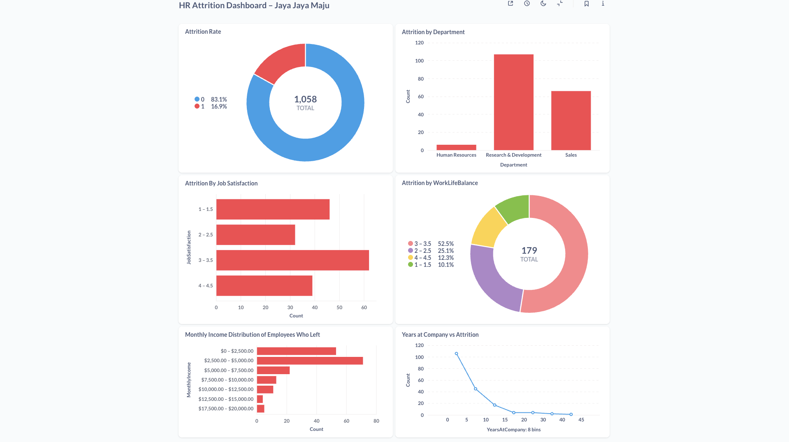

# Final Project: Solving the Problems of an Edutech Company

---

## 📘 Business Understanding

### 🎯 Background

Jaya Jaya Maju is a multinational company established in 2000, employing over 1,000 staff members across Indonesia. Despite its scale and long-standing presence, the company is currently facing serious challenges in managing its human resources—particularly a high attrition rate (the ratio of employees leaving the company to the total number of employees).

According to internal records, the company's attrition rate has exceeded the 10% threshold, indicating potential issues related to job satisfaction, managerial policies, or other underlying factors that influence employee decisions to resign. This has raised concerns within the Human Resources (HR) department, as a high attrition rate can directly affect operational efficiency and increase recruitment costs.

### ❓ Problem Statement

The HR manager is seeking assistance in gaining deeper insights into the factors that influence employee attrition. By identifying these key factors, the HR department aims to design more effective strategies and policies to reduce attrition in the future.

This project seeks to answer the following key questions:

* What are the most influential factors contributing to employee attrition at Jaya Jaya Maju?
* How can data visualizations support the HR manager in monitoring and understanding this issue?
* Is it possible to predict whether an employee is likely to leave based on their characteristics?

### 📌 Project Scope

To address the above problems, this project includes the following scope:

1. **Data exploration and understanding** of employee attributes, including demographic, job-related, and satisfaction variables.
2. **Business dashboard development** using Metabase to help the HR manager visualize and monitor the factors contributing to attrition in a clear and interactive way.
3. **(Optional) Building a machine learning model** to predict the likelihood of employee attrition as a decision-support tool for HR strategies.
4. **Conclusion and actionable recommendations** based on data-driven insights to support effective HR decision-making.

### Preparation
* **Data Source**: The [Employee](https://raw.githubusercontent.com/dicodingacademy/dicoding_dataset/main/employee/employee_data.csv) dataset used in this project is sourced from Dicoding.
* **Data Dictionary**: The dataset contains the following columns:
  * EmployeeId - Employee Identifier
  * Attrition - Did the employee attrition? (0=no, 1=yes)
  * Age - Age of the employee
  * BusinessTravel - Travel commitments for the job
  * DailyRate - Daily salary
  * Department - Employee Department
  * DistanceFromHome - Distance from work to home (in km)
  * Education - 1-Below College, 2-College, 3-Bachelor, 4-Master,5-Doctor
  * EducationField - Field of Education
  * EnvironmentSatisfaction - 1-Low, 2-Medium, 3-High, 4-Very High
  * Gender - Employee's gender
  * HourlyRate - Hourly salary
  * JobInvolvement - 1-Low, 2-Medium, 3-High, 4-Very High
  * JobLevel - Level of job (1 to 5)
  * JobRole - Job Roles
  * JobSatisfaction - 1-Low, 2-Medium, 3-High, 4-Very High
  * MaritalStatus - Marital Status
  * MonthlyIncome - Monthly salary
  * MonthlyRate - Monthly rate
  * NumCompaniesWorked - Number of companies worked at
  * Over18 - Over 18 years of age?
  * OverTime - Overtime?
  * PercentSalaryHike - The percentage increase in salary last year
  * PerformanceRating - 1-Low, 2-Good, 3-Excellent, 4-Outstanding
  * RelationshipSatisfaction - 1-Low, 2-Medium, 3-High, 4-Very High
  * StandardHours - Standard Hours
  * StockOptionLevel - Stock Option Level
  * TotalWorkingYears - Total years worked
  * TrainingTimesLastYear - Number of training attended last year
  * WorkLifeBalance - 1-Low, 2-Good, 3-Excellent, 4-Outstanding
  * YearsAtCompany - Years at Company
  * YearsInCurrentRole - Years in the current role
  * YearsSinceLastPromotion - Years since the last promotion
  * YearsWithCurrManager - Years with the current manager

* **Environment Setup**: 
```bash
pip install pandas numpy matplotlib seaborn scikit-learn sqlalchemy python-dotenv psycopg2-binary imbalanced-learn
```
| Library            | Description                                                                 |
|--------------------|-----------------------------------------------------------------------------|
| `pandas`           | For working with tabular data (dataframes).                                |
| `numpy`            | For numerical operations and arrays.                                       |
| `matplotlib`       | For basic data visualizations.                                             |
| `seaborn`          | For advanced and attractive statistical plots.                             |
| `scikit-learn`     | For building and evaluating machine learning models.                       |
| `sqlalchemy`       | For database connection and ORM operations (e.g., Metabase).               |
| `python-dotenv`    | For managing environment variables using a `.env` file.                    |
| `psycopg2-binary`  | PostgreSQL adapter for Python (used by SQLAlchemy to connect to Supabase). |
| `imbalanced-learn` | For handling imbalanced datasets with resampling techniques like SMOTE.    |

---
## Business Dashboard


The HR Attrition Dashboard – Jaya Jaya Maju was developed using Metabase and connected to a PostgreSQL database hosted on Supabase.

The dashboard presents an interactive overview of factors contributing to the company’s employee attrition rate, 
which has reached 16.9% (179 out of 1,058 employees).

Using a dedicated model called `Employee Attrition Data`, 
six key visualizations were created to help the HR team:

### 1. Attrition Rate
A pie chart clearly show that **16.9%** of employees have left the company, highlighting a critical retention issue.

### 2. Attrition by Department
The department-level analysis reveals that:
- Research & Development: 107 leavers (59.8% of all attrition cases)
- Sales: 66 leavers
- Human Resources: 6 leavers

This indicates that attrition is highly concentrated in R&D and Sales, 
signaling possible departmental issues in work conditions, stress levels, or career growth opportunities.

### 3. Attrition by Job Satisfaction
Among employees who resigned:
- 46 had very low satisfaction (1–1.5)
- 32 had low–medium satisfaction (2–2.5)
- 62 had medium–high satisfaction (3–3.5)
- Only 39 had high satisfaction (4–4.5)

This confirms that low job satisfaction is strongly correlated with attrition, and that even those with moderate satisfaction still contribute to the problem.

### 4. Attrition by Work-Life Balance
The work-life balance rating among leavers shows:
- 18 rated it poor (1–1.5)
- 45 rated it below average (2–2.5)
- 94 rated it average (3–3.5)
- 22 rated it good (4–4.5)

More than 77% of leavers reported only average or below work-life balance, suggesting that workload or inflexible schedules could be key pain points.

### 5. Monthly Income Distribution of Employees Who Left
The majority of leavers had lower income:
- 71 people earned between $2,500–$5,000
- 53 people earned less than $2,500
- Only 33 people earned above $5,000

This supports the hypothesis that compensation may be a driving factor in attrition,
especially for entry- and mid-level employees.

### 6. Years at Company vs Attrition
Attrition is highest among employees with:
- 0–5 years at the company: 106 people (59.2%)
- 5–10 years: 45 people

This suggests that early attrition is a critical issue, 
possibly linked to onboarding experience, lack of career growth, or unmet expectations during the initial years.


## Conclusion
The dashboard analysis confirms that **Jaya Jaya Maju** is facing a serious attrition challenge, with a rate of **16.9%**. It's above the company's 10% target. 
The attrition is not evenly distributed. Instead, it is heavily concentrated in the **Research & Development** and **Sales** departments. 
Key patterns indicate that employees with low job satisfaction, average or poor work-life balance, and lower monthly income are the most likely to resign.

Furthermore, **over 59%** of leavers had been with the company for **0–5 years**, 
indicating that retention efforts should be focused on early-tenure employees. 
These insights suggest that both organizational policies and employee experience 
initiatives need to be revisited to reduce turnover and improve engagement.

## Recommended Action Items
1. Enhance onboarding and mentoring programs to support new hires, especially within their first 1–2 years.
2. Conduct in-depth reviews of high-turnover departments, particularly Research & Development and Sales,
to identify leadership, workload, or engagement issues.
3. Implement employee satisfaction initiatives, such as regular feedback loops, recognition systems, and career growth opportunities.
4. Improve work-life balance policies, including flexible working hours,
mental health support, and wellness programs.
5. Review compensation structures for lower income brackets to ensure equity, motivation, and retention.


